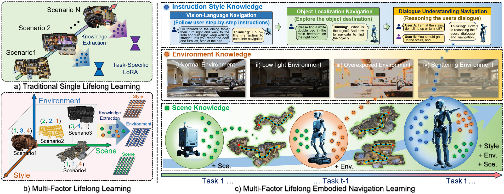

<div align="center">
# TuKA++: Multi-Factor Lifelong Embodied Navigation Learning with Tucker Adaptation



---


## Overview

Real-world embodied navigation is governed by **multiple coupled factors** — the physical **scene**, the environmental **condition** (normal / low-light / overexposure / scattering), and the **instruction style** (step-by-step, object-goal, or dialogue). Fine-tuning a navigation agent on one scenario typically causes **catastrophic forgetting** of others, which limits flexible long-term deployment.

We formalize this as **Multi-Factor Lifelong Embodied Navigation (MFLEN)**: an agent must *continually* learn from a stream of coupled navigation scenarios, *decouple* factor-level knowledge, and *dynamically compose* what it has learned during task-agnostic inference.

To solve it we propose **Tucker Adaptation++ (TuKA++)**, a high-order tensor adaptation framework that represents multi-factor navigation knowledge with a **Tucker decomposition**, decoupling scene / environment / instruction-style knowledge into factor-specific expert matrices and aligning the high-order tensor with the 2-D LLM weight matrices through tensor contraction. A **Factor-wise Knowledge Inheritance & Exploration** strategy together with a **Progressively Expandable Shared Tucker Subspace with dynamic zero-padding** enables continual learning while **structurally preserving** old-task adapters.


## Highlights

- 🧩 **Multi-factor decoupling.** Scene, environment, and instruction-style knowledge are represented as independent factor experts in a 5th-order Tucker tensor, and composed on demand at inference.
- 🛡️ **Forgetting-free by construction.** Old-task adapters are preserved *bit-exactly* under expansion via zero-padding — not a soft regularizer.
- 🌗 **All-day, multi-scene.** An extended *Allday-Habitat* simulator adds physically-based low-light, overexposure, and atmospheric-scattering degradations.
- 📊 **MFLEN benchmark.** 40 coupled tasks (30 for lifelong learning, 10 held-out for generalization) spanning VLN / OLN / DUN instruction styles.
- 🤖 **Real-world deployment.** Closed-loop navigation on a quadruped robot.


## Installation

```bash
git clone https://github.com/Ganvin-Li/TuKA-pp.git
cd TuKA-pp

# Python 3.9 environment (conda recommended)
conda create -n tukapp python=3.9 -y
conda activate tukapp

# Core deps: PyTorch (CUDA), transformers, deepspeed, flash-attn, etc.
pip install -r requirements.txt   # or follow the StreamVLN base-model setup

# Habitat is vendored under ./habitat-lab (habitat-sim >= 0.2.4 required for eval)
pip install -e habitat-lab/habitat-lab
```

**Assets to place under `data/`**:

- `data/scene_datasets/mp3d/` — Matterport3D `.glb` scenes
- `data/connectivity/` — MP3D connectivity graphs
- `data/datasets/{r2r,reverie,cvdn}_raw/` — raw R2R / REVERIE / NDH annotations
- `model_zoo/StreamVLN_Video_qwen_1_5_r2r_rxr_envdrop_scalevln/` — base StreamVLN checkpoint

```bash
# Stage A — raw annotations -> VLN-CE episodes (CPU)
bash scripts/convert_to_vlnce.sh
# Stage B — roll out expert trajectories with a ShortestPathFollower (GPU)
bash scripts/collect_trajectories.sh
```


## Training

Sequential lifelong learning over the 30 trained tasks (each task expands the shared Tucker subspace only when a new factor category appears, then hard-routes + zero-pads to preserve prior adapters):

```bash
bash scripts/streamvln_train_tuka5d.sh
```


## Evaluation

```bash
# TuKA++ per-task evaluation on val_seen for all 40 tasks
bash scripts/streamvln_eval_tuka5d_per_task.sh
```

Tasks 31–40 use factor combinations not seen during training; any truly unseen scene is automatically routed to the base model (delta = 0).
